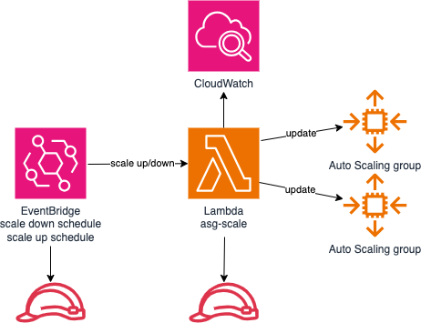

# asg-schedule

Automatic scaling of AWS Auto Scaling groups using event bridge schedule and lambda. This is just an example of how
to automatically scale autoscaling groups if for some reason, we don't have access, or cannot create
[scheduled actions](https://docs.aws.amazon.com/autoscaling/ec2/userguide/ec2-auto-scaling-scheduled-scaling.html)
under automatic scaling of desired autoscaling group. This would be much simpler and preferred in most cases.

## architecture

- scale up and scale down EventBridge cron is created (`tf/main.tf` variables)
- event triggers asg-scale lambda
  - scale down will set desired, min and max scaling config to 0 and creates/updates `asg-schedule` tag with previous config
  - scale up reads `asg-schedule` tag and resets desired, min and max scaling config from this tag

## run

- update `tf/main.tf` variables section (set appropriate autoscaling groups)
- move to `tf` directory (`cd tf`)
- run terraform `terraform init && terraform apply`
